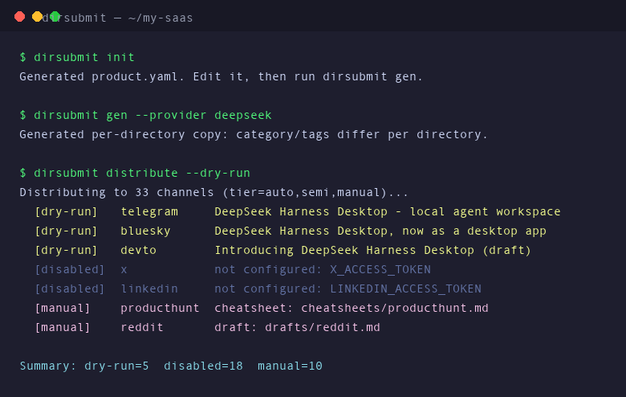

# dirsubmit

[](LICENSE)
[](https://www.python.org/)
[](https://github.com/fendouai/dirsubmit/actions/workflows/test.yml)
[](https://playwright.dev)

开源 Python CLI，一站式自动化 SaaS 分发：

- **目录提交** — 自动/半自动把你的产品提交到 SaaS/AI 目录站。
- **内容分发** — 一份产品介绍，自动改写并分发到博客 / 社交 / 社区 / 目录 / Launch 平台。

基于**三层自动化模型**：全自动（API + 无头浏览器）、半自动（CDP 复用登录态）、纯人工（草稿生成）。



## 亮点

1. **AI 差异化文案** — 为每个目录生成不同的 tagline/简介/分类/标签，避免复制粘贴被降权。
2. **CDP 双模式引擎** — 无头模式跑无登录表单；`connect_over_cdp` 复用你真实 Chrome 登录态，把「需账号」的目录也自动化。
3. **凭证检测** — 每个 API 渠道声明必需凭证；没配的渠道自动禁用，配好即自动启用。
4. **审核状态跟踪** — SQLite 记录每次提交；`status --check` 重抓目录页验证是否已上线。

## 三层模型

| 层次 | 方法 | 行为 |
|------|------|------|
| `auto` | 官方 API + 无头浏览器 | 全自动，无人值守 |
| `semi` | CDP 浏览器（复用登录态） | 自动填表，偶发验证码需人工点一下 |
| `manual` | 草稿/清单生成 | 生成适配文案，人肉发布 |

## 快速开始

```bash
# 1. 安装
pip install -e .
python -m playwright install chromium

# 2. 创建产品档案
dirsubmit init
# 编辑 product.yaml

# 3. 生成每个目录的差异化文案（无 LLM key 时自动退化模板）
dirsubmit gen --provider deepseek

# 4. 查看可用目录 / 渠道
dirsubmit list
dirsubmit channels

# 5. 提交目录（auto 用无头，manual 生成清单）
dirsubmit submit --mode headless

# 6. 统一分发（API + 浏览器 + 手动渠道）
dirsubmit distribute --dry-run
dirsubmit distribute --tier auto

# 7. 核验审核状态
dirsubmit status --check
```

## 文档

| 文档 | 内容 |
|------|------|
| [部署](docs/deployment.zh-CN.md) | 安装、依赖、CDP 配置、排障 |
| [配置](docs/configuration.zh-CN.md) | `product.yaml`、`.env`、食谱格式、LLM 后端 |
| [渠道](docs/channels.zh-CN.md) | 渠道清单、三层模型、OAuth 申请、分发地图 |

## 命令

| 命令 | 用途 |
|------|------|
| `init` | 生成 `product.yaml` 模板 |
| `gen` | 生成每个目录的差异化 AI 文案 |
| `submit` | 按 tier 提交目录 |
| `status` | 查看 / 核验提交状态 |
| `list` | 列出目录食谱（按 DR/tier） |
| `recipes` | 列出所有食谱 slug |
| `distribute` | 统一分发（API + 浏览器 + 手动） |
| `channels` | 列出所有渠道及启用状态 |

## 项目结构

```
src/dirsubmit/
├── cli.py        # CLI 入口：8 个子命令
├── config.py     # product.yaml + 环境变量加载
├── models.py     # Product / Recipe / FieldSpec / Submission
├── llm.py        # 多后端 LLM（OpenAI/DeepSeek/Gemini/Ollama）
├── copywriter.py # 按目录/按渠道生成文案
├── recipes.py    # 食谱加载/校验
├── store.py      # SQLite（提交记录 + 文案）
├── engine.py     # Playwright：headless + CDP、跨 iframe、文件上传
├── tracker.py    # 审核状态核验
├── api.py        # 18 个 API 渠道（凭证门控）
└── channels.py   # 统一渠道注册表（API + 浏览器 + 手动）
recipes/*.json    # 目录食谱（每加一个目录 = 加一个 JSON）
```

## 许可

MIT。
